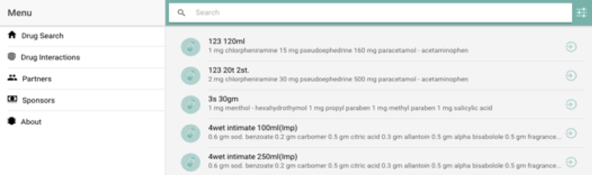

# Plan our App {#plan-our-app}

  
This is Dawaya ui, I think it’s good enough, we only want to do following edits :-   

1. Remove filter button from search bar as we will not need it !. 
2. Remove items in side menu 
3. Add all filters we want users to use in sidebar including
   1. name: search drugs by name
   2. Order By: change ordering -select one-
   3. price: price range {min, and max}
   4. companies: select checkboxes {show drugs of certain company}
   5. forms: select multiple {show drugs of certain form}
   6. groups: select multiple {show drugs of certain group}
   7. ingredients: select multiple {show drugs that contain ingredients}

as for Drug details screen, we will show exact same details as Dawaya, except that:-

* We will allow users to 
   1. click on any ingredient to show all drugs that contain this ingredient
   2. to click on a company to list all its drugs.
   3. click on drug group to show all other drugs in this group
   
in addition,it would be nice if we would add above drug list we will show a nice bunch of cards that give useful information "statistics"

Enough talking! let’s write some code, it took us 18 mins to setup database and decied on feature list, we only have 42mins left to finish this project so lets move on!.

Steps:
* First we do our nodejs express powered backend, 
* then we design routes for app and convert design to html and css

