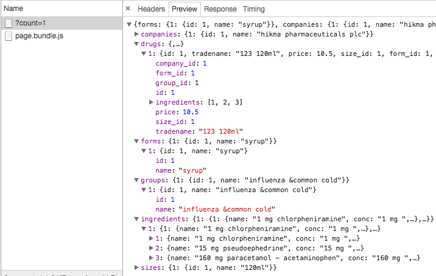

# Project planning.

if you have read , [Chapter 4 Basic Knowledge of Project planning](../chapter_4/project_planning_and_management.md) you already know what to do :)

now we have 2 projects to create, 

1. frontend progressive web app client built with react.js
2. backend Api built with node.js and express

steps we will follow to plan for both projects are same.

* **step 0:** Requirements collection : Done
* **Step 1:** user store backlog : Done
* **Step 2:** tasks breakdown
* **Step 3:** Execution
* **Step 4:** Re-evaluate position and repeat this cycle;

## Project Backend Api built with node.js and express

### Step0 Requirments

our backend should return our newly created drugs.json database

### Step1 User story

* a user should be able to view the entier database from route **/databsae**
* a user should be able to paginate drugs router `/?page=[int=1]&count=[int=100]`
* a user should be able to filter drugs **/?companies=\[List , separated\]&forms=\[string List comma separated\]&price=\[string-":" separated [int]-\]**
  * example : `/?companies=1,2&forms=3,4&price:0:100`

### Rules For Api Desings

* your api endpoints naming should clearly state its intent
* a GET request is always used to get results
* `/Endpoint` should always return a List
* `/Endpoint/:id` should always return a single record and its details.
* PUT and DELETE requests always edit an exsistent record, and so /Endput/:id id param in url are required for any PUT,DELETE.
* if you want to alter the data returned from an endpoint you use Query Params `?`
* when showing Lists, you should implement Famous [Pagination design Pattern please make sure you are aware of the pattern and its differnet types](chapter_4/design_patterns.md)
  * if your dataset is static -doesnot increase in size- then use `Offset based pagination pattern` otherwise use `cursor based pagination pattern`
  * in this api, since our dataset size is fixed, we will use Offset based pagination.

To make things intersting, we will also use a  **Test Driven Development Approach or TDD for short**, if you have never written a unit test before dont be afraid, this app is simple and straight forward and i will try to keep this as simple as possible :).

### Step 2 Tasks backlog

* create server folder inside dawaya folder
* init npm project for express and install dependencies
* init Github prject `git init`
* create our index.js and index.spec.js (*tests for index) and [move drugs.json we created using our NodeJS tool](chapter_5/dawaya_data_structure.md) into to inside /server folder.
* Create our Routes, for every route we will start by creating a `.spec.js` file, then we write tests, and try to make it pass
  * create our /download route
    * should return entire database
  * create our / route
  * implement pagination
  * implement our first filter
  * implement all filters


Enought Planning Lets Run some code :)

```shell
> cd ~/course-workspace/dawaya
> cp ../src/database.json ./database.json
> touch index.js index.spec.js
> git init
Initialized empty Git repository in /Users/momen/course-workspace/dawaya/server/.git/
> npm init
```

this will create our server folder, and copy database.json to inside it, then create index.js and index.spec.js, then initial a new npm project inside this project.

npm will ask you a few questions, most important one is "test command" here is how i answered them

```shell
name: (server) dawaya-server
version: (1.0.0) 
description: 
entry point: (index.js) 
test command: mocha -R ./*.spec.js
git repository: 
keywords: 
author: 
license: (ISC) 
About to write to /Users/momen/course-workspace/dawaya/server/package.json:

{
  "name": "dawaya-server",
  "version": "1.0.0",
  "description": "",
  "main": "index.js",
  "scripts": {
    "test": "mocha -R ./*.spec.js",
    "start": "node server.js"
  },
  "author": "",
  "license": "ISC"
}


Is this ok? (yes)
```

thats it :) we are ready

** FYI: you need to install mocha globaly, if you don't have it then just type `npm install -g mocha` , mocha is our test framework.

now lets install our nodejs Express using yarn or npm `yarn add express` or `npm install --save express`

### TDD 

We talked about test development and agile development in earlier chapters, but in brif when using TDD, you are supposed to 

* write the test code before writting single line of production code
* you only write enought/minimal amout of code to make your test pass, no more
* you should not use browser or anyother software to check the result of your code like you normaly do, your workflow should be as follow:
  * write the test
  * write code to make it pass
  * run test
    * if it pass, then you move along to next test writting
    * if it fail, then you move back to production code and fix it.

So The habbit of writting a few lines, then go to browser to check the result, then adding few more lines and so one, **you need to drop it !** from now on you will trust that your code works as expected if it does pass the test you wrote !.

now for testing we will use `mocha` and `supertest`

Lets write our first Test to implement our first Task

```shell
Task 1:  create our /download route
Details: this route should return our entier database.
```

very easy and clear task.

open index.spec.js and write our first test

```javascript
//index.spec.js
const request = require('supertest');
const assert = require('assert');
const app = require('./index.js');

describe('Dawaya Server Tests', function () {

  describe('/Download route', function () {

    it('respond with json object', function(done) {
        request(app)
        .get('/download')
        .set('Accept', 'application/json')
        .expect('Content-Type', /json/).expect(200,done)
    }); 
    it('respond is a true object', function(done) {
      request(app)
        .get('/download')
        .set('Accept', 'application/json')
        .end(function(err, response){
          assert.ok(!err);
          assert.ok(typeof response.body === 'object');
          assert.ok(Array.isArray(response.body) === false);
          return done();
        });
    }); 
  })
})
```

save then create express app @ index.js

```javascript
///dawaya/server/index.js
const express = require('express')
const app = express();
const database = require('./database.json');


app.get('/download', function (req, res) {
  res.send({});
})

app.listen(1234, function () {
  console.log('Example app listening on port 1234!')
})

module.exports = app;
```

now save following and run `yarn start test`
your shoudl see output

```shell
Example app listening on port 1234!
  Dawaya Server Tests
    /Download route
      ✓ respond with json object
      ✓ respond is a true object
```

great, task one say that /download should return our entier database.

so lets add another test this, 

```javascript
 const dbShape = ['forms','companies','groups','ingredients','sizes','drugs'];
 it('it should have all 6 Records in repsonse', function(done) {
        request(app)
        .get('/download')
        .set('Accept', 'application/json')
        .expect(200)
        .end(function(err, response){
          keys = Object.keys(response.body)
          
          // all 6 eys exists
          assert.ok(keys.length===6);
          // make sure all keys exists
          assert.ok( dbShape.filter(i=>keys.indexOf(i)===-1).length===0);

          return done();
        });
    }); 
```

now save and run `yarn run test` it will fail as expected, so lets implement this

```javascript
///dawaya/server/index.js
const express = require('express')
const app = express();
const database = require('./database.json');


app.get('/download', function (req, res) {
  res.send(database);
})
//..rest
```

now save and run `yarn run test`;

```shell
  Example app listening on port 1234!
  3 passing (580ms)
✨  Done in 2.75s.
```

Yes :) it works, i hope by now you can see the benfits of TDD.

1. you no longer need to go back and forth between your code editor and browser to check if your code works !
1. if anyone broke your code, your tests will tell you !
1. it let you develop the most sophisticated code peace by peace.

okay task 1 is done, lets see task 2
```
* create our / route
  * implement pagination
    * max page records 100,
  * implement our first filter
  * implement all filters
```

create test for / route, as task say we should create / route, it return emty object at this point

```javascript
describe('/download route', function () {
  //.. code
})
describe('/ route', function () {
  it('return json with code 200', function(done) {
    request(app)
      .get('/')
      .set('Accept', 'application/json')
      .expect(200, done);
  }); 
}); 
```

save and run.

```shell
 Example app listening on port 1234!

  3 passing (636ms)
  1 failing

  1) Dawaya Server Tests / route return json with code 200:
     Error: expected 200 "OK", got 404 "Not Found"
      at Test._assertStatus (node_modules/supertest/lib/test.js:266:12)
      at Test._assertFunction (node_modules/supertest/lib/test.js:281:11)
      at Test.assert (node_modules/supertest/lib/test.js:171:18)
      at Server.assert (node_modules/supertest/lib/test.js:131:12)
      at emitCloseNT (net.js:1575:8)
      at _combinedTickCallback (internal/process/next_tick.js:77:11)
      at process._tickCallback (internal/process/next_tick.js:104:9)


error Command failed with exit code 1.
```

Failed :). ops we forgot to implement it 

go to index.js and add this route.

```javascript
app.get('/', function (req, res) {
  res.send(null);
})
```

awsome, next we need pagination..

now this is tricky because we need to setup paginnation for Drugs, and drugs contain relations with other tables. so we will need to return X number of drugs and all its relations.

so first we need to make sure it reture true shape that we need same as /dowload does, so we will copy and past that test from /download tests

```javascript
// .. rest of index.spec.js
it('respond is a object with daways db shape', function(done) {
  request(app)
    .get('/')
    .set('Accept', 'application/json')
    .end(function(err, response){
      assert.ok(!err);
      assert.ok(typeof response.body === 'object');
      assert.ok(Array.isArray(response.body) === false);
      // since we didnt define a page count, it should return the default maximum drugs which are 100
      assert.strictEqual(Object.keys(response.body.drugs).length, 100);
      return done();
    });
}); 
```

> Testing tip 
> so far we where using asset.ok, which make sure value is == true, but there are many more assert functions

|Tests Tip| desc|
|:---:|:---:|
| equal | check that argA == argB|
| notEqual | reverse or equal|
| strictEqual | check that argA === argB|
| notStrictEqual | check |
| deepEqual | check  that argA == argB recussive|
| notDeepEqual | reverse of deepEqual|
| deepStrictEqual | check that argA === argB recussive|
| notDeepStrictEqual | reverse of deepStrictEqual|

> End of Tip

now coding implementation in index.js

```javascript
const getEmptyDb = () => ({
  forms:{},
  companies:{},
  groups:{},
  ingredients:{},
  sizes:{},
  drugs:{},
});

app.get('/', function (req, res) {
  res.send(getEmptyDb());
})
```

now save and `yarn run test` it will pass :), ext we want getEmptyDb to get array of ids and return drugs db and other tables requeried to populate these drugs

```javascript
function getPartOfDatabase(array_of_drug_ids){
  const data = getEmptyDb();
  return array_of_drug_ids.reduce(function reducer(carry,id){
    let drug = database.drugs[id];
    carry.drugs[id] = drug;
    carry.forms[drug.form_id] = database.forms[drug.form_id];
    carry.companies[drug.company_id] = database.companies[drug.company_id];
    carry.groups[drug.group_id] = database.groups[drug.group_id];
    carry.sizes[drug.size_id] = database.sizes[drug.size_id];
    carry.ingredients[id] = drug.ingredients.reduce((all,i)=>Object.assign(all,{[i]:database.ingredients[i]}), {});

    return carry;
  },data)
}
app.get('/', function (req, res) {
  let drug_ids = Object.keys(database.drugs).slice(0,100);
  res.send(getPartOfDatabase(drug_ids));
})
```

now run ur test.. and success :) our api will return a drugs from 0-100, we want to pass some custome numbers and test that too. so back to index.spec to add one more test

```javascript
// .. rest of index.spec.js
it('it should return 20 drug', function(done) {
  request(app)
    .get('/')
    .query({ count: 20 })
    .set('Accept', 'application/json')
    .end(function(err, response){
      assert.strictEqual(Object.keys(response.body.drugs).length, 20);
      return done();
    });
}); 
```
run test `yarn run test` and it fail with `Uncaught AssertionError: 100 === 20` since we forgot to implement again !

#### Access Request Query Params.

in above we access req.query[PARAM_NAME] this is how you access query params using nodejs express.

open index and lets edit /

```javascript
app.get('/', function (req, res) {
  let page = isNaN(Number(req.query.page)) ? 1 : Number(req.query.page);
  let count = isNaN(Number(req.query.count)) ? 100 : Number(req.query.count);
  
  let lower = (page-1) * count;
  let upper = page * count;
  let drug_ids = Object.keys(database.drugs).slice( lower, upper);
  
  res.send(getPartOfDatabase(drug_ids));
})
```

save and now we have paginnation up and running :) task accomplish. now to final and last requestment of backend

> * implement our first filter
> * implement All filter

#### Denormalize untill it works

Following famous quote

> Normalize untill it hurts, then Denormalize until it works

lets check our current api database see how we can denormalize it so that filtering can become easier !

to do this we will do use our server, with pagination we created, and view database of single drug `/?count=1` 
run `node index.js` sinde server folder, then
[open the browser @ http://localhost:1234/?count=1](http://localhost:1234/?count=1);



to make search easier, we will add a Drugs attribute to all shapes, sizes, and compaines this attribute will contain a list `[]` array of all ids of drugs that links to it so for example a drug width id 777 that has `company_id=1` then `companies[1].drugs[777]` should exisits. 

> go ahead and write such transformation for database using nodejs just like we did before. then lets continue with our api.

To do filtering now, to filter for specific company for example `?companies=1,2` will combine companaie[1].drugs and companies[2].drugs and return result. we also want the filters to stack so for example `?companies=1,2&groups=1` should return drugs from comapny 1 OR 2, where group_id is 1.

lets dive into code.

```javascript
  const allowed_filters = ['companies','forms','groups','sizes'];
  const filters_map = {
    'companies':'company_id',
    'forms':'form_id',
    'groups':'group_id',
    'sizes':'size_id'
  };
  let filters = allowed_filters.filter(name=>Boolean(req.query[name]));
```
this will import queries's from `req.query` then we want to get a list of drugs that fit those criteria, and select the shortest array of them as seed for final result

```javascript
const arrays = [];
  filters.map(i=>{
    arrays.push( 
      [].concat.apply([],  
        query[filters_map[i]].map(x=>database[i][x].drugs)
      )
    )
  })
  var shortest = arrays.reduce((p,c)=>p.length>c.length?c:p,drug_ids);
```

awesome, now we will fiter the shortest to make sure it pass all other filters, and also to make sure it pass our custome "price", and "name" filters

> price is custome filter because it will accept [max]:[min] as value and return true if price of drug is within value
> name is also custome because it will search drug tradename case insenstive and in any part of text \*part\*

```javascript
//step2 make sure this list pass all filters
  const drugs = shortest.filter(id=>{
    const score = arrays.filter(list=>list.includes(id)).length;
    console.log(`id ${id} ${score===arrays.length?'pased':'failed'} with score:[${score}]/${arrays.length}`);
    
    if(req.query.price){
      const prices = req.query.price.split(':');
      if(prices.length===2){
        if(
          database.drugs[id].price > prices[1] ||
          database.drugs[id].price < prices[0]
        )return false;
      }
    }

    if(req.query.name){
      if(
          database.drugs[id].tradename.toLowerCase().indexOf(req.query.name.toLowerCase()) === -1
      )return false;
    }

    return score===arrays.length;
  });
```
finally we return the part of the database that matched our query params, and slice it to pass our pagination tests.
```javascript
  const db = getPartOfDatabase(drugs.slice( lower, upper));
  db.length = drugs.length;
  db.count = count;
  db.page = page;
  db.offset = page * count;
  
  res.send(db);
```


TaDaaa. our Server is done in **25min** and it can : 
1. list all drugs, 
2. Offset based Paginattion to save data bandwidth
3. Filter enabled using 4 attributes
4. can filter with Price range
5. Can filter by searching for substring inside trade name.
6. Its took all heavy lifting off Client. now our backend is the one responsible for handling data.

one more feature to add to is which is "Server Side Cacheing"

#### Server Side Cacheing

[thanks to libraries like  Api cache](https://github.com/kwhitley/apicache) you can easily add cache to our nodejs App with simple 2 lines of code.
first install this library using `yarn add apicache`;
then edit our index.js add this to top of file

```javascript
import apicache from 'apicache'

let cache = apicache.middleware
app.use(cache('5 minutes'))
```

although our api was already fast, average request time with maximum filter work took `95ms` "Average of 10 page loads"

after implementing apicache , now average time dropped to `32ms` .. over 3X performance boost with just 3 lines of code!!.

thats it now apicache will handle caching all outes for 5 mins :), we can increase duration if you feel like you need the performance boost.