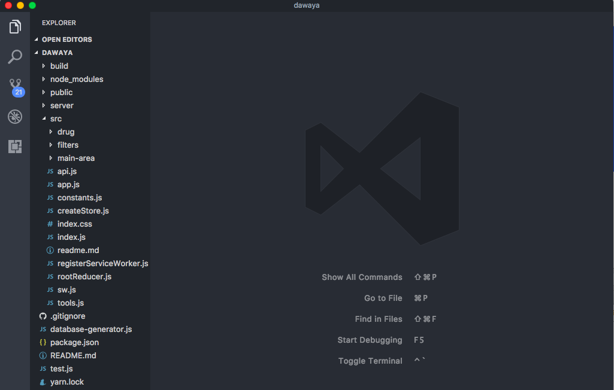

# Frontend React.js Client

planning a reactjs client falls into 2 parts,

| Client Deisgn | State Management |
|:--:|:--:|
| routes, components, ui&ux | this is like database design but for frontend.|

for best maintaince you need to create a definative separation between 

1. the parts of the app that will handle getting data from api, and saving it, and manipulating the data (state management)
2. the parts of the app thats going to present such data for user (ui)


## Step 2 Task break down

if you have read [Project planning and management](chapter_4/project_planning_and_management.md) you already know how this will go.

### A. create components list and folder structure

* project root
  * delete all files inside /src to start clean :). we dont need create-react-app demos.
  * index.js --> app entry and setup
  * app.js --> main app component or Root component as some people call it
  * createStore.js --> create Redux store;
  * api.js --> setup our apisauce Fetch in this file,
  * rootReducer.js --> our main redux reducer file
  * contstants.js --> app configs and constants
  * styles.js --> app main styles
  * actions.js --> app common redux actions
  * tools.js --> will contain help functions
  * sw.js --> service worker we will use to cache api requests
* sidebar
  * Filters /src/filters/index.js
    * Price /src/filters/priceFilter.js
    * Tradename /src/filters/name.js
    * OrderBy /src/filters/orderby.jsƒ
    * Tree Like list with checkboxs /src/components/Tree.js will be used in all other filters
* main-content-area
  * Header /src/main-area/header.js
  * Statistics /src/main-area/stats.js
  * company /src/main-area/company.js in case there where only 1 company selected, we will show its name ina nice formated card on top of list.
  * List /src/main-area/drugList.js
  * Index /src/main-area/index.js this is where we will glue all above parts together to compose main content area

### B. List All Actions and webapp behaviours

* /ROOT/DRUGS/LOAD_DRUGS/
* /ROOT/DRUGS/LOAD\_MORE\_DRUGS/
* /ROOT/FILTER/UPDATE/ (key, value)
* /ROOT/FILTER/CLEAR/

Thats it, our simple app have only 3 behaviours

* 1st to fetch drugs from api and save it in our store
* 2nd to set a filter and its value
* 3rd to clear all filters.

so our state will look like this

```json
{
  show_sidebar: true,
  db:{
    .. clone from server db
  },
  filters:{
    name: [], // array of strings, contain keywords to search for drug.
    price: [0,0],
    groups: [],
    forms: [],
    // ..etc all filters will hold an array of ids
    keys: [], // list of keys of drugs to show on right side, this will update everytime db/filters changes, its a computed value so it shouldnt be in state, but we will leave it for now just for sake of simplicity
  },
  router:{} // will contain react-router location information, this key is handled by react-router-redux
}
```

and our routes will be

1. / -> show list of drugs
2. /:id -> show details of a specfic drug
3. /list/:type => show list of a /:type, all group, form, company etc that match filter props
3. /list/:type/:id => show all drugs of a /type, group, form, company etc

#### C. implement all components UI (this is first Task.)

1. open dawaya in terminal
1. lets create all folders needed and all files too. you can use `mkdir` and `touch` commands to do this super fast !.

```shell
  rm -rf ./src
  mkdir ./src && ./src/main-area && mkdir ./src/filters && mkdir ./src/drug && mkdir ./src/lists
  cd ./src
  touch index.js app.js api.js rootReducer.js createStore.js tools.js constants.js styles.js sw.js index.css
  cd ./main-area
  touch index.js DrugsList.js LinkCmp.js reducer.js actions.js
  cd ../sidebar;
  touch index.js priceFilter.js TreeCmp.js reducer.js actions.js
  cd ../drug
  touch index.js
  cd ../lists
  touch index.js ListCmp.js
```

these commands will create all folders and empty files that we will use in our app

carry on and create all files we listed in step A. final structure of project should look like following:-



now we need to setup github.

1. cd back to your daway project root
1. initiate your git repo `git init`
1. commit and push our project `git add . && git commit -m"initial commit" && git push`
1. branch out to design-layout `git checkout -b layout-design` in this branch we will create all our ui

Thats it, its straight simple app, now that you have all your folders and files you can assign diffeent team members to work on every part. draw a dependency graph that link every realted components together.
then you can assign these independent parts to different team members if you have.

[open your vscode and lets code, please check my screen cast for how we implemented the ui](https://youtube.com/alzalabany/reactjs-cours "momen's yourtube")

## create all CONSTANTS, TYPES, ACTIONS needed

lets open the readme.md file we created, and copy all behviour list that we saved earlier.
open new file and past the list into it, now we want to generate redux TYPES.

use search and replace function of your vscode, we will use regex search and replace to create file

search for `(.*)/([A-Z_]+)/` and replace it with `exports.types.$2 = "$1/$2/";` . out put that your 
list should now be converted into

```javascript
/ROOT/DRUGS/LOAD_DRUGS/
/ROOT/FILTER/UPDATE/
/ROOT/FILTER/CLEAR/
```

see how easy this was :), this is why i keep a list of all behaviours in a readme file, so that i can use this list to generate boilerplate code in future :)

now open `/src/constants.js` and copy past your types into it

```javascript
// constants.js
const exports = {};
exports.types = {};
exports.types.LOAD_DRUGS = "/ROOT/DURGS/LOAD_DRUGS/";
exports.types.UPDATE = "/ROOT/FILTER/UPDATE/";
exports.types.CLEAR = "/ROOT/FILTER/CLEAR/";
export default exports;
```

one thing we need to consider is cacheing !. how are we going to cache requests ? should we do it in application logic ?

there is 2 things that can go wrong when getting data from your api and saving it to store.

1. Overfetching
  * this mean that you fetch data too frequent even though you already have data that your app needs
2. Underfetching
  * you fetch data in response to certain triggers that **can** in a certain senario lead to your app seek some data from local store and not find it because your app did not fetch such data from db.


so for this app. i will prefer to handle cache inside the server-worker, advantages of this

1. easier implementation, drugsReducer now dont need to merge new data
1. service-worker runs on another thread, so our app will now be utlizing multiple threads, which will give a greate bonuce performance
1. its very easy to setup caching in service-workers. way easier than amount of hacking required if we where to implement this in react-redux.
1. will allow us to go with **Overfetching** wihout worrying toomuch about wasting data traffic, since our service worker will handle these requests on client side without hitting our server.

Thans it we have all our reducers. lets create our root reducer :)

inside ./src/rootReducer.js


you can view all source code @ [https://github.com/alzalabany/course-frontend.git](https://github.com/alzalabany/course-frontend.git "Course full project");