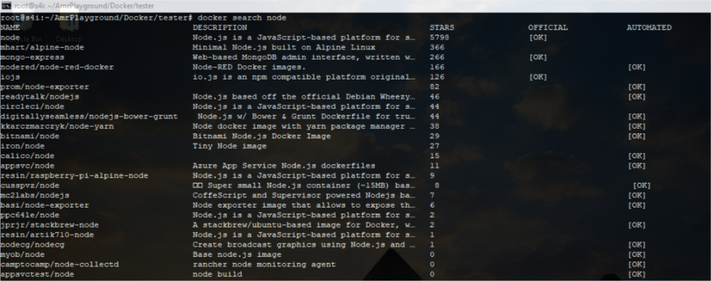
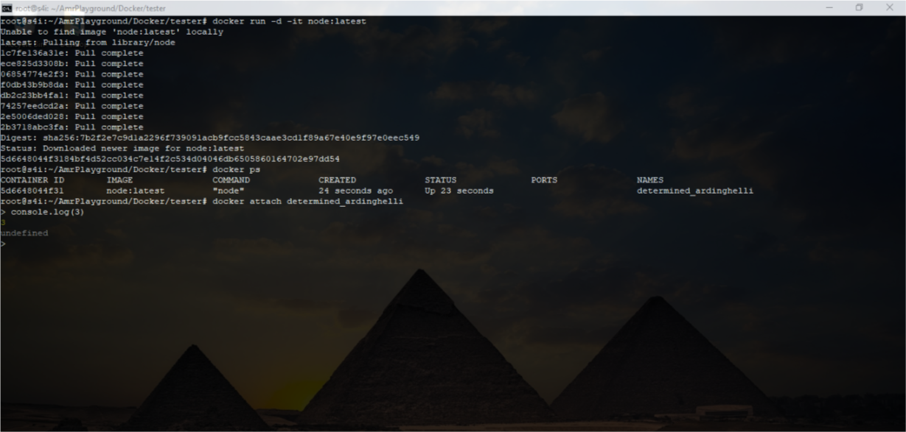
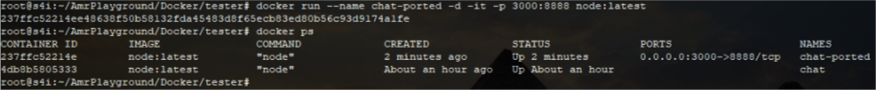
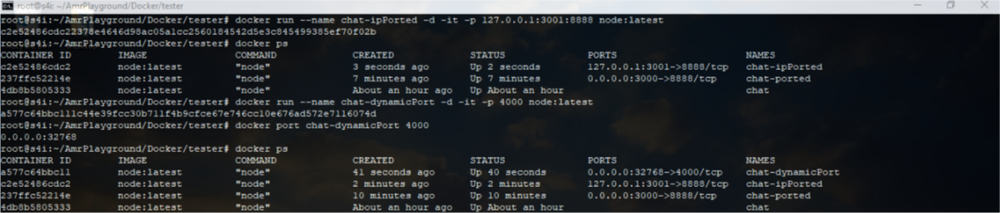
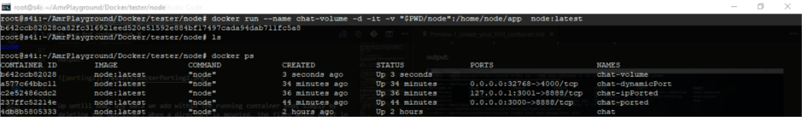

# Create your first container

You want to make a nodejs container. So you first need an image, so you either have it locally or you pull it from [Docker hub](https://hub.docker.com/) . But how to check if it even exists, you can either go to [Docker hub](https://hub.docker.com/) and search for it manually, or do it from the CLI
```bash
docker search node
``` 
Output:



Now, we have confirmed that an image exists lets run the latest version of it, which is called a "container", to run in the background. And check for if it is actually running.

```bash
docker run -d -it node:latest
docker ps
docker attach <container-name|container-ID>
``` 

>**Note: if you want a different version one can write node:\<node-version\>**

Lets break down those few lines:
- "run" allows us to create allows us to ro create the container process by naming an image afterwards
- "-d" runs the container in detached mode meaning it will make it run in the background
- "-it" this is usually split into two commands
    - "-i" Keep STDIN open even if not attached
    - "-t" to run a pseudo terminal
- "ps" is used to list running containers
- "attach" is to re-attach the container and actually use nodejs
- "\<container-name|container-ID\>" you get the ID or name from ps as per output below



Now, imagine you have multiple contaiers, like if you ran "docker run -d -it node:latest" ten times to create ten different containers, what a hassle would it be to find a specific one through all those random names and IDs, right?

Lets say you are creating this container for a chatting app, now lets make a new container but first we need to remove the old one:
```bash
docker rm -f <container-name|container-id>
docker run --name chat -d -it node:latest
```
lets brake down those few commands:

- "rm" removes the container specified by it name or ID
    - you can add "-f" to force the removal, in some cases like a running container without stoping it with "docker stop <container-name|container-ID\>"
- "--name \<friendly-name\>" this allows you to name your container whatever you want

Now, run 
```bash
docker ps
```
to check the neame.

>**Pro tip:** if you have multiple containers and want to delete them all at once you can
```bash
docker rm -f $(docker container ls -a -q)
```
- "container ls" listscurrently running containers
    - "-a" displays all of containers even exited ones
    - "-q" shows only the container-id

so its listing all ids with rm command to remove at once.

Its really good to have a container running, however it is not accessible as each container is sandboxed. for the service within the contaienr to be accessible to other processes, a port needs to be exposed. This makes processes within the container accessible as if running on the host OS itself.

```bash
docker run --name chat-ported -d -it -p 3000:8888 node:latest
docker ps
```
let break it down:

- "-p <host-port\>:<container-port\>" here we specified the host will communicate via port 3000 to the container and the container will be listening on 8888

output:



>**Pro tip**: By default all mapping is done to 0.0.0.0 meaning all IP addresses. So, to map to a single IP we can "-p 127.0.0.1:3001:8888"

Now if we want to run ten instances of this container we will have a conflict due to the port 3000 being used. So we need to use a random free port each time we run an instance.

```bash
docker run --name chat-dynamicPort -d -it -p 4000 node:latest
docker port chat-dynamicPort 4000
docker ps
```
lets break it down:
- "-p \<container-port\>" here we used port 400 to be the port that listens within the container

output:




Up untill now, any data we add within the running container ends simply by deleting the container. When a directory is mounted, the files which exist in that directory on the host can be accessed by the container and any data changed/written to the directory inside the container will be stored on the host. This prevents loss of data When creating and deleting containers.

```bash
docker run --name chat-volume -d -it -v /root/AmrPlayground/Docker/tester/node:/home/node/app  node:latest
```
lets break it down:
- "-v \<host-dir:container-dir\>" -v is used before specifying a volume, then I used my working dir and created a folder "node" for the data. To specify the contaienr dir you need to read about the image you are using in my case this one [docker node](https://github.com/nodejs/docker-node/blob/master/README.md#how-to-use-this-image)

>**Pro tip:** we can use $PWD place holder
```bash
docker run --name chat-volume -d -it -v "$PWD/node":/home/node/app  node:latest
```
Output:




Exercise:
1. using what you learned, delete all containers with one command.
2. create one new container with the name you want and a dynamic port