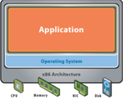
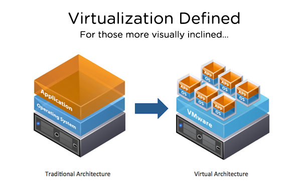

# History lesson

## A Jog down memory lane

In the past the only choice was that every physical server, had a single OS running on top of it then an application as shown below.

### limitations

* Slow deployment
* Huge costs & Waste of resources
* Difficult to scale & migrate
* Vendor lock-in

## Virtualization

### What is a Virtual Machine

Virtualization basiclly is a technology that allows you to create multiple simulated environments. These simulated environments are seperate, distinct and secure environments called "Virtual Machine" - AKA VMs.

### How is a Virtual Machine done

There exists softwares that are installed ontop of the physical layer. The physical layer plus the software is called the "Host"- an example of this software is "hypervisor". And the VMs on top of it are cakked "Guests". Hypervisor is responsible to manage the computer resources, like CPU, as a pool of resources and dedicated the required resource to any of the VMs according to its needs and configuration.

### VM Benefits

* Resource Pooling
* Scalability
* VMs can be deployed on the cloud
  * Less hardware hassle
  * Cost reduced

### VM Limitations

* Each VM needs to be allocated hardware, hence more VMs means more hardware
* Guest OS on each VM

## Containers

### What is a container

Containers allow you to package your application with all its required runtime dependencies without the hassle of having an OS like a VM. This makes it light-weight virtualization.

### How is a container done

This is done by creating an image where it acts as a blueprint for any container that is built from it (we'll get into this vocabulary in the next section). The container technology, we'll be discussing is Docker.

### Container Benefits

* standerdize your development and deployment environments
* They are light-weight when comapred to VMs
* Better in resource management like storage, CPU and adding more (in cases like user spikes)

### Container Limitations

* Less secure than VMs. As containers have root access and share the same OS, hence any kernel level vulnrability can jeoprodize all containers
* Contaienrs are ontop of an OS, then in order to use a new server (unless you use virtual machines on the same server)

> We mainly you use docker, when having a developer team where each developer has different setup so you want each of them to have a local standarn environment

## Setup

I found that the [documentation](https://docs.docker.com/install/#desktop) is sufficient for this. Make sure to read the requirements and if there isn't any that fit your critertia, then you can checkout the "docker legacy toolbox".