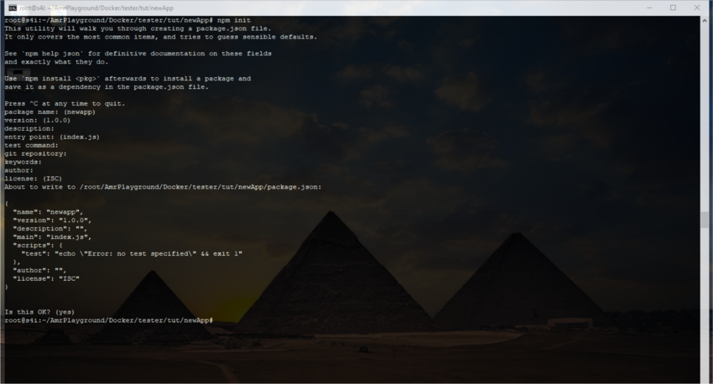

# Build our own Image

In the past section we built an image from the CMD, but to add anything we had use `docker exec -it <container ID|Container name> bash`. This made it really a hassle, if you want to add anythin simple as `npm install`. That is why "Dockerfile" exists, to help you add what ever you want to the image so that when you run it. But first lets setup a pseudo environemt with express to work with it.

```sh
mkdir newApp && cd newApp
npm init
```

keep hitting enter, as we are just creating a dumby. you'll end up creating a packge.json file. lets break it down:

* `mkdir newApp` allows you to create a new directory "newApp"
* `cd newApp` allows you to change directory
* `npm init` this initiate npm the package manager to create a package.json file through few questions



now lets use express generator to add some files and work with them.

```bash
npm i -g express-generator
```

lets break it down:

* `i` triggers npm to install
* `-g` triggers npm to install globally

We added express generator to use it and generate our dumby files. you should prompted that that express generator was updated or added.
Now, lets generate that directory. lets break it down:

```bash
express --view=pug .
```

lets break it down:

* `express` calls the generator
* `--view` allow you to set the viewing engine and we used pug for that
* `.` to select current directory

```bash
   create : public/images/
   create : public/stylesheets/
   create : public/stylesheets/style.css
   create : routes/
   create : routes/index.js
   create : routes/users.js
   create : views/
   create : views/error.pug
   create : views/index.pug
   create : views/layout.pug
   create : app.js
   create : package.json
   create : bin/
   create : bin/www

   install dependencies:
     $ npm install

   run the app:
     $ DEBUG=newapp:* npm start
```

This is how your current directory should look like.

```bash
.
├── app.js
├── bin
│   └── www
├── package.json
├── public
│   ├── images
│   ├── javascripts
│   └── stylesheets
│       └── style.css
├── routes
│   ├── index.js
│   └── users.js
└── views
    ├── error.pug
    ├── index.pug
    └── layout.pug

7 directories, 9 files
```

So, you package.json, have some new dependencies by now, so lets install them with npm. And then start npm.

```bash
npm install
DEBUG=newapp:* npm start
```

Now, open up a new terminal and curl local host at port 3000

```bash
curl http://localhost:3000
```

You'll be promted the following:

```html
<!DOCTYPE html><html><head><title>Express</title><link rel="stylesheet" href="/stylesheets/style.css"></head><body><h1>Express</h1><p>Welcome to Express</p></body></html>
```

## Dockerfile and Dockerignore

## Dockerfile

### What is a dockerfile

It is simply a text document that has a sequence of instructions that when used via a command called `build`, an image is built according to the configuration spexified.

### lets make a dockerfile

Use what ever texteditor you want and create a file called "Dockerfile", I will be using nano for editing. This is how the file looks like.

```Dockerfile
FROM node:9-alpine
RUN mkdir -p /src/app
WORKDIR /src/app
COPY package.json /src/app/package.json
RUN npm install
COPY . /src/app
EXPOSE 3000
CMD [ "npm", "start" ]
```

WOW! right? no worries. lets break it down:

* `FROM <image>:<tag>` basically uses a base image, which is node version 9 running with alpine - a light weight linux. Then we'll configure it with our dependencies
* `RUN mkdir -p /src/app`
  * `RUN` allows us to run any command on top of the image and commits it to it.
  * `mkdir -p /src/app` creates a directory within the contaienr `-p` allows to create a directory with subdirectory

* `WORKDIR <directory>` it is used to set our working directory, so that any commands are run within this directory
* `COPY <src directory> <dest directory>` Copy is used the first time to copy our package.json to the working directory.
* `RUN npm install` we are running npm within the working directory to install the dependencies of the previous
* `COPY . /src/app` this time we are copying our entire directory to the working directory
* `EXPOSE <port>` we are exposing port 3000 to communicate with the container on
* `CMD["Executable", "param1", "param2"]` here we are just using executable npm and a param start, but in other cases we can use more

> Pro tips:
>1. RUN vs CMD:
>    * RUN: commits changes to the image and there can be multiple runs
>    * CMD: runs a default command when the container is run. There can only be one CMD
>2. You may find an `ONBUILD`, while searching around how to make faster builds but for the time being it is deprecated
>3. Docker caches some data to make future builds faster and if that data was for some reason not matching on the following build. It rebuilds the image from scratch. That is why we only  copy the pachage.json before `RUN npm install`. because if we copy the code it will invalidate on every code change
>4. to run without cache you can use `--no-cache=true`
>5. if you don't specify a tag it will just be latest by default
>6. it tempting to use `node:latest`, but it is a risk as you can meet a lot issues

Now that we have setup our image lets build it.

```bash
docker build -t my-nodejs-image:V1.0.0 .
```

lets break it down:

* `build` allows you to select a docker file and build an image from a Dockerfile
* `-t <friendly-name>:<tag>` here we used my-nodejs-image as name and versioning number V1.0.0 as a tag this helps me know what version is this image on

Next, lets run that container

```bash
docker run -d --name running-node -p 3000:3000 my-nodejs-image:V1.0.0
```

>if you find this instruction difficult. You can refer to [this page](./create_your_first_container.md)
>
>Pro tip: you can change the environment the container is running in by simply adding a `-e`, like this `docker run -d --name running-production-node -e NODE_ENV=production -p 4000:3000 my-nodejs-image:V1.0.0`

Lets check that everything went fine. Let `curl` our docker container. use `docker ps` to get the containers IP. mine was 0.0.0.0 and we exposed port 3000.

```bash
curl http://0.0.0.0:3000
```

## Dockerignore

Now, lets say you have some directories that aren't worth copying or are to sensetive to be copied. How can you not add them to your container. So again what is it.

### What is a .dockerignore

Its simply a text file, with syntax similar syntax like .gitignore

### lets make a .dockerignore file

So lets make a text file called "secretSauce.txt" and add it to .dockerignore

```bash
echo "there is no sauce" >> secretSauce.txt
echo secretSauce.txt >> .dockerignore
docker build -t my-nodejs-image-nosauce:V1.0.0 .
docker run my-nodejs-image-nosauce:V1.0.0 ls /src/app
```

okay, so lets break down:

* `echo "there is no sauce" >> secretSauce.txt` just created a file with some pseudo text
* `echo secretSauce.txt >> .dockerignore` we just added
* We rebuilt the image with the ".dockerignore"
* we are lisiting the directories within our working directory and

```bash
Dockerfile
app.js
bin
node_modules
package-lock.json
package.json
public
routes
views
```

TADA! you secretSauce is hidden.

>pro tip: id you want to use the secret sauce, you can use it in `RUN` command. So you need to copy, run and delete it with `RUN` commands.

Exercises:

1. create an image run it in different environments and what differnce can it make
2. try to add and hide huge file with dockerignore to see the difference in build time